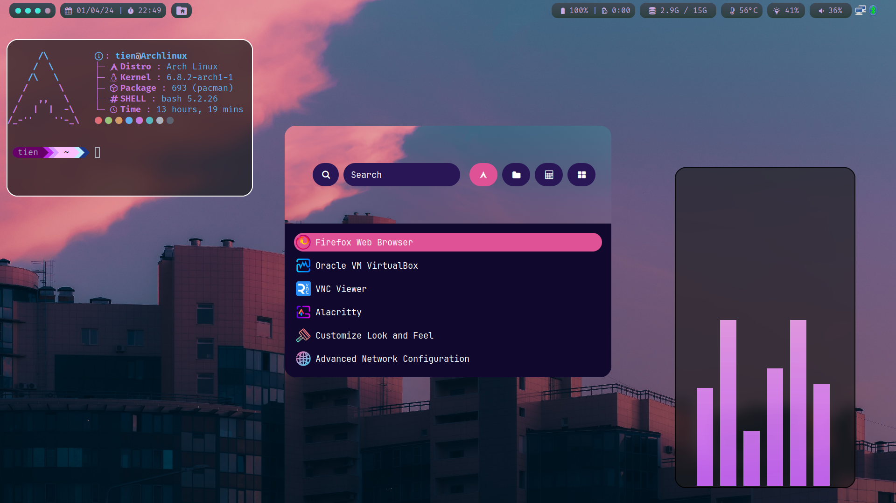
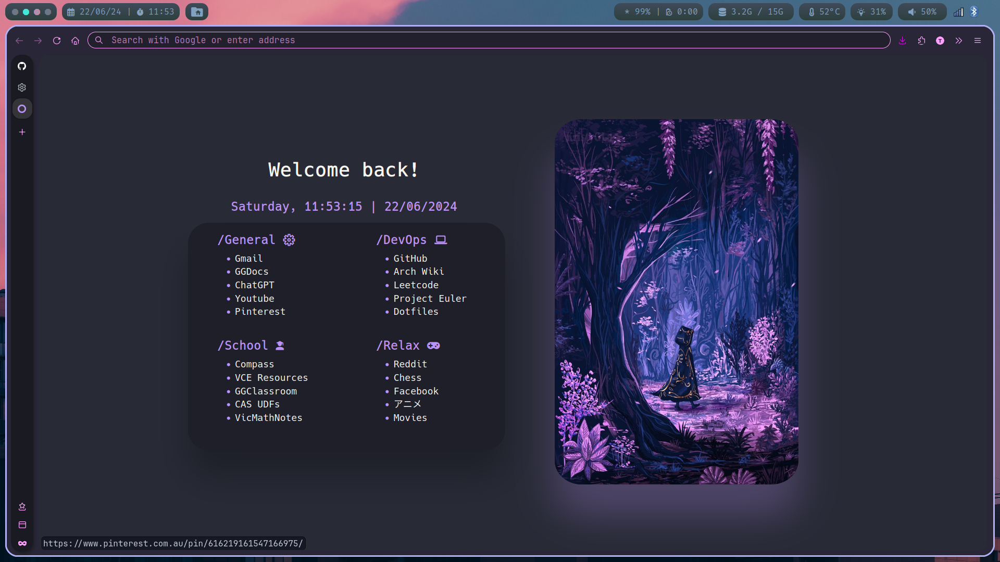

<h1>My Qtile Rice</h1> 

<h2>Introduction</h2>

I started my ricing journey during my year 11's long summer holidays, finally decided to learn  more about the linux system, which has led me to exploring awesome linux's rices and also craft my very unique own rice. ( I use arch btw :> )

<h2>Details</h2>

#### Core Programs
<ul>  
<li><b>Operating System:</b> Arch Linux</li>
<li><b>Window Manager:</b> Qtile</li>
<li><b>Display Manager:</b> None (display manager is bloated)</li>
<li><b>Terminal Emulator:</b> St</li>
<li><b>Prompt Customisation:</b> Starship</li>
<li><b>Search tool:</b> Rofi (along with aur packages rofi-emoji and rofi-calc)</li>
<li><b>Compositor:</b> Picom (simpleanims's fork with animations)</li>
<li><b>Wallpaper Setter:</b> Feh</li>
<li><b>Notfication Daemon:</b> Dunst</li>
<li><b>Text Editor:</b> Neovim</li>
<li><b>Text/Icon Fonts:</b> FiraCode Nerd Font/Candy-Icons</li>
<li><b>GTK Theme:</b> Sweet-Dark</li>
</ul>

#### Other Cool Programs
<ul>
<li>System Viewer: pfetch</li>
<li>PDF Viewer: zathura</li>
<li>Music Player: moc (Music On Console)</li>
<li>Music Visualiser: cava</li>
<li>Firefox Theme: Copied heavily from <a href="https://github.com/RoyalHeart">@RoyalHeart</a></li>
<li>Screen Locker: betterlockscreen</li>
<li>Network Manager: NetworkManager</li>
<li>VPN Service: protonvpn-cli</li>
<li>Sound Daemon: pipewire (more convenient than pulseaudio)</li>
<li>Bluetooth Daemon: bluetoothctl</li>
<li>Brightness Daemon: birghtnessctl</li>
</ul>

<h2>Final Words</h2>

As the set-up is my daily driver for school and personal use, this repo will be maintained and updated regularly based on my own interest. The firefox customisation was mainly from <a href="https://github.com/RoyalHeart">@RoyalHeart</a> and <a href="https://github.com/Godiesc">@Godiesc</a>, therefore the css file in my repository contains some changes to the original file as to fit my taste of a perfect firefox homepage. 

Qtile window manager is great for beginners to dive in the world of ricing linux since it's extremely hackable with both floating and tiling window mode. Definitely not a watse of time if you value your experience (Windows and MacOS are bloated)

<h2>Finally Final Words</h2>

Probably I am gonna switch to hyprland for its nice-looking set-up and add to this repo, hoping it does not crash for my Nvidia graphic card ;)

I am working on an install script for my set-up so see ya :))

